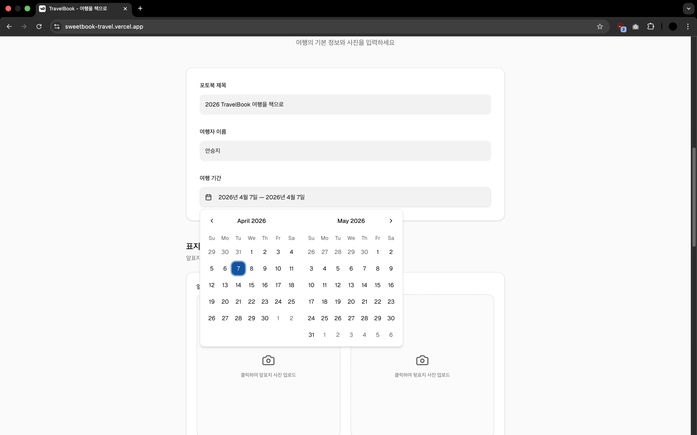
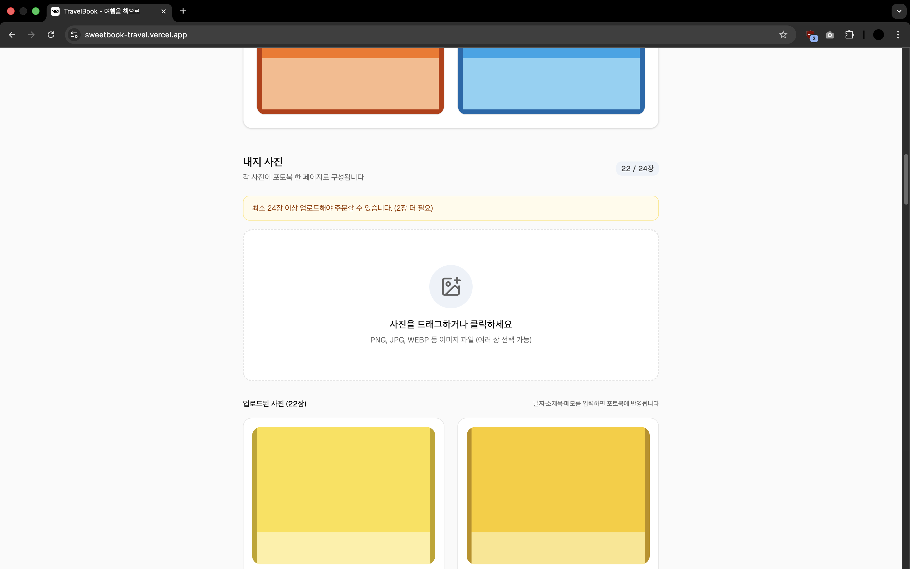
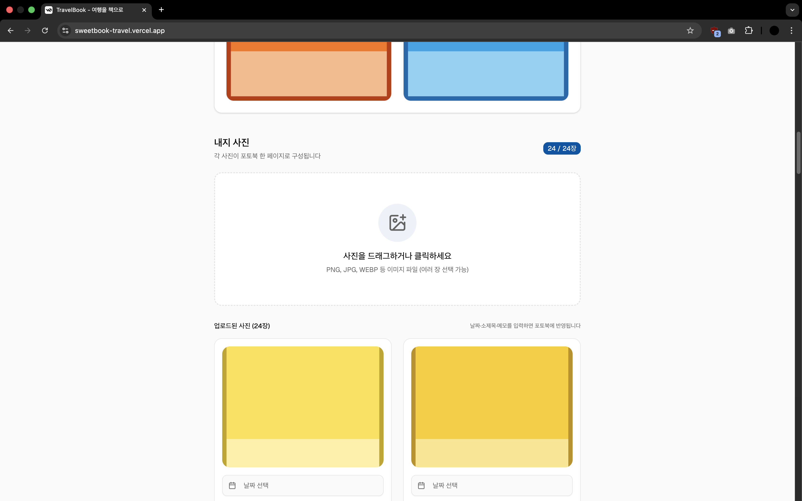
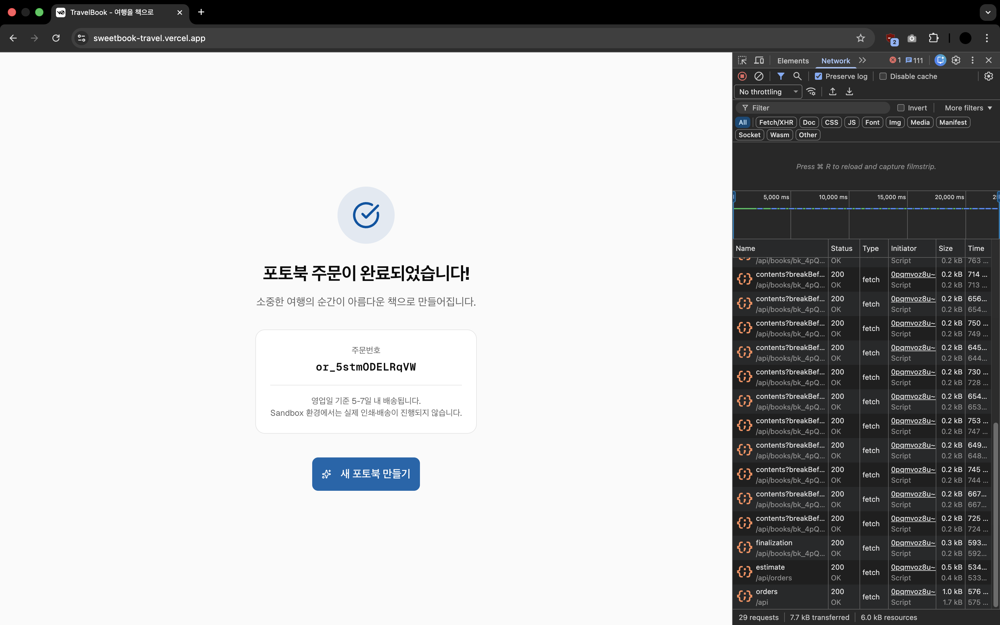
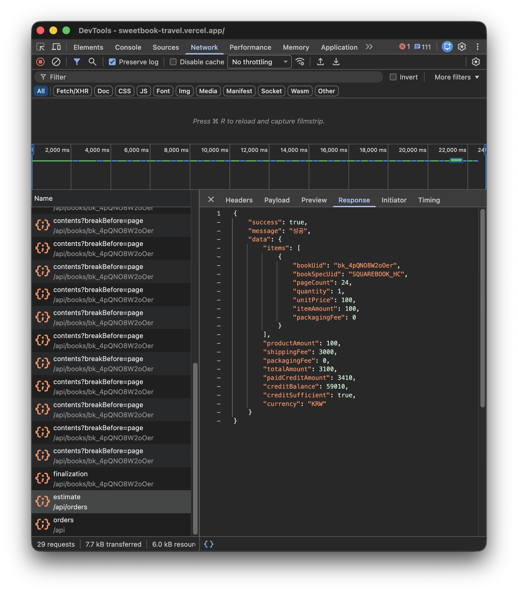

# TravelBook — 여행을 책으로

소중한 여행의 순간들을 아름다운 포토북으로 간직하세요.
사진을 업로드하고 추억을 기록하면, 세상에 하나뿐인 나만의 여행 포토북이 완성됩니다.

Book Print API([api.sweetbook.com](https://api.sweetbook.com))를 활용한 여행 포토북 주문 웹 애플리케이션입니다.

---

## 서비스 소개

| 항목 | 내용 |
|------|------|
| 서비스 | 여행 사진을 업로드하면 실제 인쇄·배송되는 포토북을 주문할 수 있는 서비스 |
| 타겟 고객 | 여행 사진을 의미있게 보관하고 싶은 개인 여행자 |
| 주요 기능 | 사진 업로드 + 날짜·소제목·메모 입력 → 포토북 주문 원스톱 플로우 |

---

## 실행 방법

```bash
# 1. 의존성 설치
npm install

# 2. 환경변수 설정
cp .env.example .env.local
# .env.local 파일을 열어 API Key 입력

# 3. 개발 서버 실행
npm run dev
```

브라우저에서 [http://localhost:3000](http://localhost:3000) 접속

---

## 환경변수

`.env.example` 파일을 복사하여 `.env.local`을 만들고 아래 값을 설정하세요.

```env
SWEETBOOK_API_KEY=your_sandbox_api_key_here
SWEETBOOK_API_URL=https://api-sandbox.sweetbook.com/v1
```

> API Key는 [api.sweetbook.com](https://api.sweetbook.com) 파트너 포털에서 발급받을 수 있습니다.
> Sandbox 환경에서는 실제 인쇄·배송이 이루어지지 않습니다.

---

## 빠른 테스트 (더미 데이터)

API 연동 전체 플로우를 즉시 테스트할 수 있도록 더미 이미지와 데이터를 제공합니다.

### 테스트 이미지 위치

```
public/dummy/images/
├── cover-front.png   # 앞표지용 (주황색)
├── cover-back.png    # 뒷표지용 (파란색)
├── content-01.png    # 내지 1장 — 제주 도착
├── content-02.png    # 내지 2장 — 렌터카 출발
├── ...
└── content-24.png    # 내지 24장 — 제주와 작별
```

### 테스트 순서

1. **앞표지**: `cover-front.png` 업로드
2. **뒷표지**: `cover-back.png` 업로드
3. **내지 사진**: `content-01.png` ~ `content-24.png` 24장 업로드
   - 각 사진의 날짜·소제목·메모는 `public/dummy/dummy-travel-data.json` 참고
4. **포토북 제목**: 예) `2026 제주도 여행`
5. **여행자 이름**: 예) `홍길동`
6. **여행 기간**: 2026.03.15 ~ 2026.03.18
7. **배송 정보** 입력 후 **포토북 주문하기** 클릭

### 더미 데이터 JSON

`public/dummy/dummy-travel-data.json`에 24장 내지의 날짜·소제목·메모 텍스트가 포함되어 있습니다.
제주도 3박 4일 여행 테마로 구성되었습니다.

```json
{
  "meta": {
    "title": "2026 제주도 여행",
    "travelerName": "여행자",
    "dateFrom": "2026-03-15",
    "dateTo": "2026-03-18"
  },
  "contents": [
    {
      "index": 1,
      "date": "3.15",
      "title": "첫째 날\n제주 도착",
      "diaryText": "긴 비행 끝에 드디어 제주에 도착했다..."
    }
  ]
}
```

---

## 사용한 API 목록

Book Print API의 핵심 생명주기 전체를 실제로 호출합니다.

| 순서 | API | 용도 |
|------|-----|------|
| 1 | `GET /book-specs` | 사용 가능한 판형 목록 조회 |
| 2 | `GET /templates` | 판형에 맞는 표지/내지 템플릿 조회 |
| 3 | `POST /books` | 포토북 객체 생성 (bookUid 발급) |
| 4 | `POST /books/{bookUid}/cover` | 앞·뒷표지 이미지 및 템플릿 설정 |
| 5 | `POST /books/{bookUid}/contents` | 내지 사진 1장씩 추가 (최소 24회 반복) |
| 6 | `POST /books/{bookUid}/finalization` | 포토북 확정 (이후 변경 불가) |
| 7 | `POST /orders/estimate` | 실제 견적 조회 — 크레딧 충분 여부 확인 후 주문 진행 |
| 8 | `POST /orders` | 주문 생성 및 배송 정보 등록 (`Idempotency-Key` 포함) |

사용한 템플릿:

| 구분 | UID | 이름 |
|------|-----|------|
| 표지 | `4MY2fokVjkeY` | cover 템플릿 (SQUAREBOOK_HC) |
| 내지 | `3FhSEhJ94c0T` | 내지a_contain (일기장B 테마) |

---

## AI 도구 사용 내역

| AI 도구 | 활용 내용 |
|---------|----------|
| Claude (Opus 4.6, claude.ai) | 공고/과제 분석, 스위트북 비즈니스 분석, 서비스 기획, 기술 스택 결정, 개발 전략 수립, 프롬프트 설계 |
| Claude Code (Sonnet 4.6) | API Routes 구현, 프론트-백엔드 연동, 표지/내지 분리 로직, UX 수정, 더미 데이터 생성 |
| v0 (Vercel) | 초기 UI 프로토타입 생성 (shadcn/ui 기반) |
| Cursor (IDE 내장 에이전트) | 코드 리뷰, 커밋 메시지 작성, 세부 수정사항 반영 |
| ChatGPT (5.4 Pro) | 작업 기록 정리, 세션 맥락 추출 및 문서화 보조 |
| Gemini | 작업 프로세스 점검, 우선순위 조정, 인지부하 관리 보조 |

---

## 설계 방향

TravelBook은 단순 사진 업로드 서비스가 아닙니다. 각 내지에 날짜·소제목·메모를 페이지 단위로 입력해 여행 순서를 직접 편집하고, 실물 포토북 주문까지 연결하는 원스톱 서비스입니다.

부가 기능을 넓히기보다 **Book Print API의 핵심 생명주기(책 생성 → 표지 → 내지 반복 → 최종화 → 견적 → 주문)를 실제로 끝까지 검증하는 데 범위를 고정**했습니다. `orders/estimate`를 실제 UI에 연결해 API 견적을 표시하고, 크레딧 부족 시 주문을 차단하는 흐름까지 구현했습니다.

**왜 여행 포토북인가?**
Book Print API의 기존 파트너 사례(280days, 세줄일기, 작가의탄생)를 분석한 결과, 공개된 파트너 서비스가 모두 알림장·일기·원고 등 텍스트 중심의 기록형 콘텐츠였습니다. 반면 스위트북 B2C의 핵심 상품인 사진 중심 포토북을 다루는 API 파트너는 아직 없었습니다. 여행 사진은 스마트폰에 묻혀 있기 쉽지만 포토북으로 만들면 영구적으로 간직할 수 있고, 1인 파트너 관점에서 가장 명확한 수요와 완결된 API 플로우를 가진 주제라고 판단했습니다.

**비즈니스 가능성**
- 여행 시장은 꾸준한 수요, 포토북은 선물용으로도 활용 가능
- AI 자동 캡션 생성, 지도 연동 등 기능 확장 여지가 큼

**더 시간이 있었다면**
- 카카오 우편번호 API 연동
- 주문 상태 조회 페이지 (Webhook 기반)
- 사진 드래그&드롭 순서 변경

---

## 검증한 API 특성

직접 curl로 탐색하고 코드로 연동하면서 확인한 실제 API 동작 특성입니다.

| 발견 내용 | 상세 |
|-----------|------|
| **cover 필수 파라미터** | `dateRange`, `spineTitle` 누락 시 422 Validation Error |
| **contents 파일 필드명** | `files`가 아닌 `photo1`이어야 인식됨 (템플릿 상세 조회로 확인) |
| **SQUAREBOOK_HC 최소 페이지** | 24페이지 미달 시 finalization 400 오류 발생 |
| **finalization Content-Length** | body 없이 POST하면 411 Length Required — 빈 body 전송 필요 |
| **Idempotency-Key** | orders 생성 시 필수. 미포함 시 중복 차감 위험 |
| **Sandbox vs Live** | base URL만 교체하면 전환 가능 (`api-sandbox.sweetbook.com` → `api.sweetbook.com`) |
| **템플릿 파라미터 구조** | 템플릿마다 요구 파라미터가 달라 `GET /templates/{uid}` 상세 조회 후 form-data 맞춰야 함 |

---

## 스크린샷

**1. 입력 시작 화면**



포토북 제목, 여행자 이름, 여행 기간, 표지 업로드를 입력하는 시작 화면

---

**2. 내지 24장 미충족 상태**



최소 24장 조건을 충족하지 못한 상태. 배지가 비활성(secondary)으로 표시되고 주문 버튼이 비활성화됨

---

**3. 내지 24장 충족 상태**



최소 24장 조건을 충족하면 배지가 primary(파란색)로 전환되고 주문 가능 상태로 변경됨

---

**4. 주문 완료 화면 — API 호출 순서 확인**



`finalization → estimate → orders` 순서로 요청이 실행된 뒤 주문 완료 화면이 표시됨. 네트워크 탭에서 전체 생명주기 호출 순서를 확인할 수 있음

---

**5. `/orders/estimate` 응답 확인**



`POST /orders/estimate` 호출 후 실측 견적(`totalAmount`, `productAmount`, `shippingFee`)과 `creditSufficient: true` 값을 확인한 화면

---

## 기술 스택

| 영역 | 기술 |
|------|------|
| 프론트엔드 | Next.js 16 (App Router), React 19, TypeScript |
| 스타일 | Tailwind CSS v4, shadcn/ui |
| 백엔드 | Next.js API Routes (서버에서 API Key 관리) |
| Book Print API | Sweetbook Book Print API (Sandbox) |
